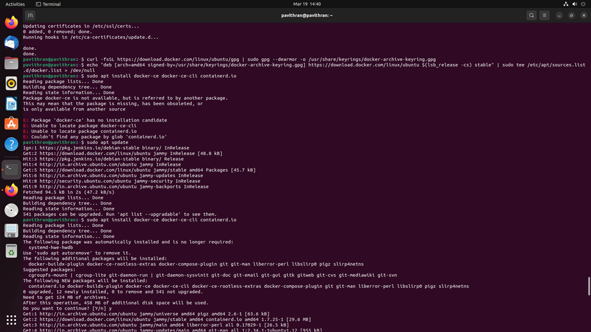
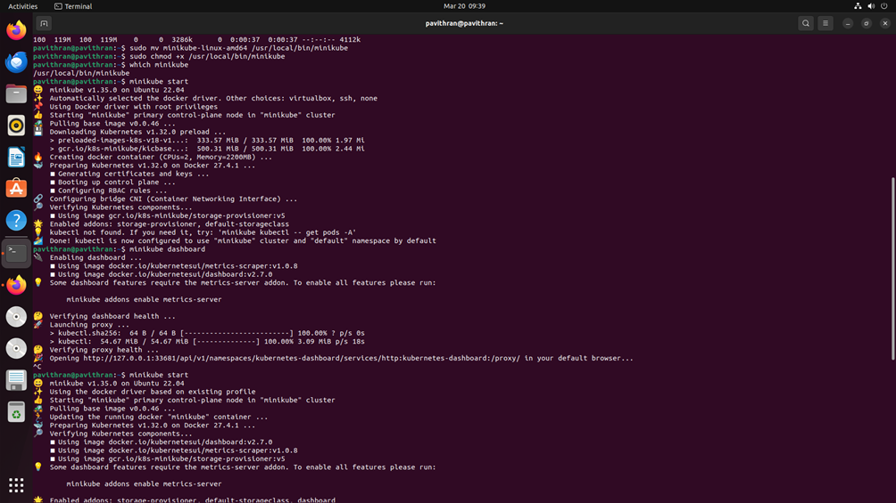
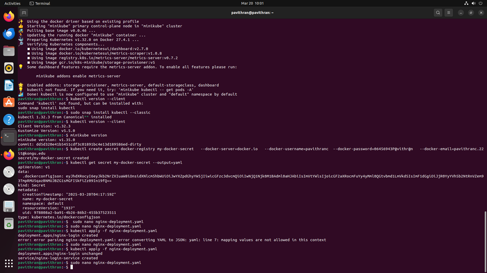
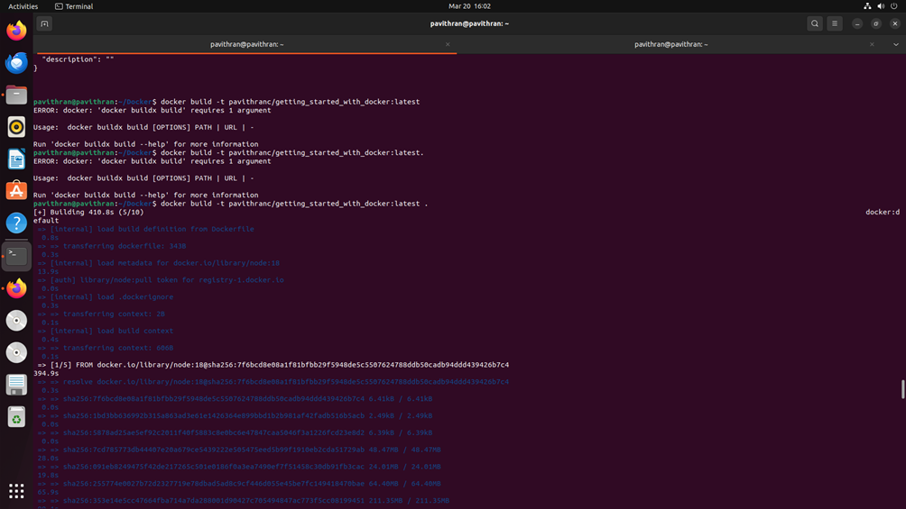
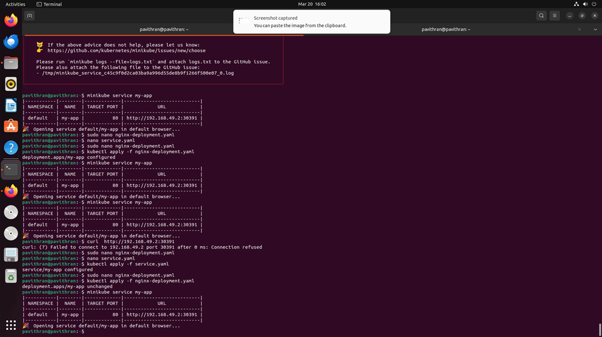

# Installing and setting up Kubernetes Minikube

## Update system packages and Install dependencies
```bash
sudo apt update && sudo apt upgrade -y
sudo apt install -y curl wget apt-transport-https conntrack socat
```


## Install Docker, Kubectl and Minikube
### Install Docker
```bash
sudo apt install -y docker.io
sudo systemctl start docker
sudo systemctl enable docker
docker --version
```


### Install Kubectl
```bash
curl -LO "https://dl.k8s.io/release/$(curl -L -s https://dl.k8s.io/release/stable.txt)/bin/linux/amd64/kubectl"
chmod +x kubectl
sudo mv kubectl /usr/local/bin/
kubectl version --client
```
### Install Minikube
```bash
curl -LO https://storage.googleapis.com/minikube/releases/latest/minikube-linux-amd64
sudo install minikube-linux-amd64 /usr/local/bin/minikube
minikube version
```


### Fix Docker setup
```bash
sudo usermod -aG docker $USER
reboot
```

### Verify Installation after reboot
```bash
docker run hello-world
```


## Start and open Minikube
```bash
minikube start --driver=docker
minikube dashboard
```


## Deployinig the docker image from dockerhub

```bash
mkdir docker
nano  Dockerfile
npm init -y
```



```bash
npm init -y // again if the previous command installed npm
cd ..
docker pull pavithranc/getting_started_with_docker:latest . // replace with your docker uid/repo:image_tag
cd docker
```


```bash
docker build -t pavithranc/getting_started_with_docker/latest // replace with your docker uid/repo:image_tag
docker ps -a
```



```bash
sudo nano nginx-deployment.yaml
kubectl apply -f nginx-deployment.yaml
sudo nano service.yaml
kubectl apply -f service.yaml
kubectl get pods
minikube get svc my-app
minikube service my-app --url
curl <url>
```



 - open the url in browser


## Config file codes
Dockerfile
```groovy
# Use an official Node.js runtime as a base image
FROM node:18

# Set the working directory
WORKDIR /app

# Copy package.json and install dependencies
COPY package.json ./
RUN npm install

# Copy the rest of the application
COPY . .

# Expose port 3000 and start the app
EXPOSE 3000
CMD ["npm", "start"]
```

nginx-deployment.yaml
```groovy
apiVersion: apps/v1
kind: Deployment
metadata:
  name: my-app
spec:
  replicas: 1
  selector:
    matchLabels:
      app: my-app
  template:
    metadata:
      labels:
        app: my-app
    spec:
      containers:
      - name: my-app
        image: pavithranc/getting_started_with_docker:latest
        imagePullPolicy: IfNotPresent
        ports:
        - containerPort: 8080
```

service.yaml
```groovy
apiVersion: v1
kind: Service
metadata:
  name: my-app
  namespace: default
spec:
  type: NodePort  # Ensures external access via a specific port
  selector:
    app: my-app
  ports:
    - protocol: TCP
      port: 80       # Service port inside the cluster
      targetPort: 80  # The container's port
      nodePort: 30391   # Externally accessible port
```
